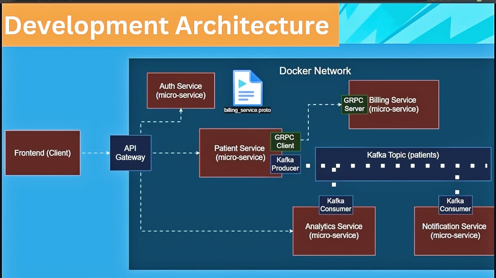
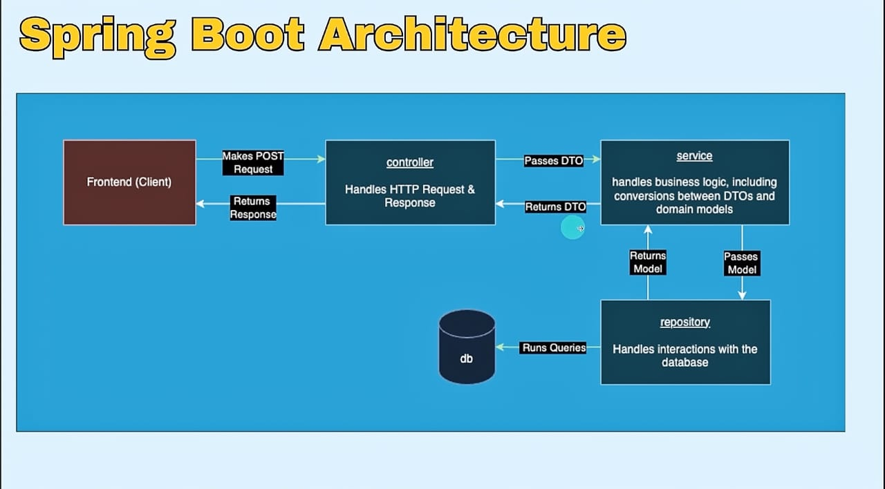
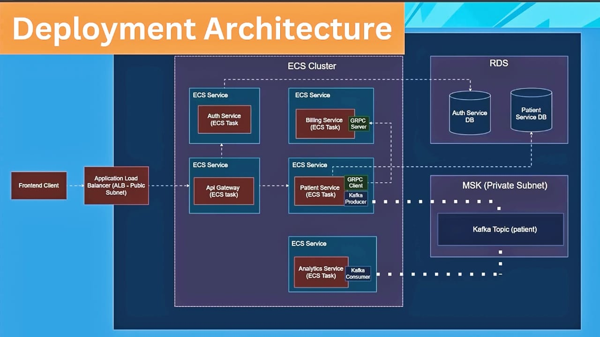

# Patient Management System (Microservices) - In Progress

This project is a **microservices-based Patient Management System** built using modern backend architecture.  
It is currently in progress and focuses on modular, scalable, event-driven design.

---

## 🚀 Current Status
- Completed: **Patient Service Microservice**
  - CRUD APIs for patient data
  - Layered architecture: Controller → Service → Repository
  - Integrated with **Postgres database**
- Upcoming Modules: Auth, Billing, Analytics, Notification, API Gateway

---

## 🏗️ Tech Stack

- **Backend:** Java, Spring Boot
- **Microservices & Containers:** Docker
- **Database:** Postgres
- **Communication:** REST & gRPC
- **Messaging/Event Streaming:** Kafka
- **Cloud Deployment:** AWS ECS, RDS, MSK
- **Others:** API Gateway, Load Balancers, Localstack for local AWS testing

---

## 📚 What I’m Learning/Implementing


---

## 🧩 Architecture

### 1. Development Architecture


### 2. Spring Boot Layered Architecture


### 3. Deployment Architecture


---

## ✨ Features (Planned)

- Manage Patients, Doctors, and Appointments
- Authentication & Authorization (JWT / Bearer Tokens)
- Event-driven communication using Kafka
- Real-time communication using REST & gRPC
- API Gateway for routing and load balancing
- Deployment to AWS (ECS, RDS, MSK)

---

## 📂 Current Module

### Patient Service
- **Repository Layer:** Handles DB interactions with Postgres
- **Service Layer:** Business logic and DTO to domain conversions
- **Model Layer:** POJOs for patient entities

---

## 🛠️ How to Run (for Patient Service)

1. Clone the repository:
   ```bash
   git clone https://github.com/your-username/patient-management-system.git
   cd patient-management-system/patient-service

2. Configure Postgres database in application.properties

3. Run:
   ```bash
   ./mvnw spring-boot:run

   ```

## 📝 Next Steps


- Add Auth, Billing, Analytics and Notification services
- Set up Kafka communication and gRPC
- Containerize services with Docker
- Deploy on AWS ECS

---

## 📌 Status

- This project is under active development.
- Check the repo regularly for updates as more microservices are implemented.

---
